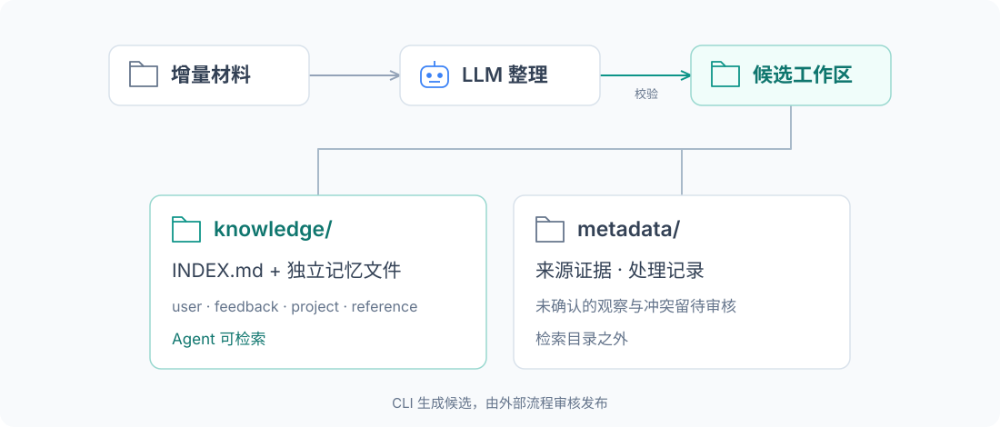
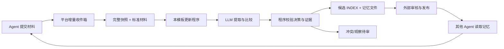

<p align="center">
  
</p>

<h3 align="center">把一次协作的经验，带到下一次对话。</h3>

<p align="center">
  用简短索引与独立记忆文件，为不同会话、不同 Agent 提供可追溯的长期上下文。
</p>

<p align="center">
  <a href="#快速运行">快速体验</a> ·
  <a href="#组织方式">记忆结构</a> ·
  <a href="#安装到平台">安装到平台</a> ·
  <a href="docs/protocol.md">更新协议</a> ·
  <a href="https://github.com/oh-my-harness/folder-knowledge-service">Folder KB 服务</a>
</p>

<p align="center">
  
</p>

<p align="center"><strong>Markdown 记忆</strong> &nbsp; / &nbsp; <strong>LLM 增量整理</strong> &nbsp; / &nbsp; <strong>来源可追溯</strong> &nbsp; / &nbsp; <strong>协议 1.1</strong></p>

## 让记忆可复用

将增量材料整理为可跨会话、跨 Agent 使用的文件记忆，兼容 [Folder KB](https://github.com/oh-my-harness/folder-knowledge-service) 工作目录协议 1.1。Python 3.11+，运行程序无第三方依赖。

| 记住有用信息 | 持续整理更新 | 连接你的 Agent |
|---|---|---|
| 用户偏好、行为反馈、项目约定、资料位置，按适用范围保存。 | 去重、补充、明确纠错与冲突待审，保留来源和变更记录。 | 打包为 Folder KB 模板，以现有文件读取和搜索工具使用记忆。 |

> [!NOTE]
> 当前通过 CLI 执行更新，生成候选工作区后由外部流程审核发布。平台已支持安装与绑定；通用更新调度和模型凭据注入尚未实现。

## 组织方式

```text
memory-workspace/                 # 完整更新工作区
├── knowledge/                    # 平台只挂载这一层供 Agent 检索
│   ├── INDEX.md                  # 一条记忆一行：标题、类型、作用域、摘要、链接
│   ├── user_<id>.md
│   ├── feedback_<id>.md
│   ├── project_<id>.md
│   └── reference_<id>.md
└── metadata/memory-template/      # 不对消费 Agent 暴露
    ├── state.json                # 模板状态和托管文件哈希
    ├── processed.jsonl           # 材料哈希、处理决策、变更前内容
    └── review.jsonl              # 不确定/冲突/观察材料；有待审材料时创建
```

| 类型 | 内容 |
|---|---|
| user | 用户长期背景、习惯和偏好 |
| feedback | 用户对 Agent 行为的明确反馈 |
| project | 特定项目的背景与约定 |
| reference | 外部资料或系统的位置及用途 |

每条记忆有适用范围、更新时间、材料 ID、来源和证据原文。同名事实在不同项目里可以不同；程序禁止跨作用域改写。作用域只是整理语义，访问隔离仍由平台知识库和 Key 权限负责，不能代替用户隔离。

组织方式参考 [Claude Code auto memory](https://code.claude.com/docs/en/memory#auto-memory)。这是独立 Folder KB 模板，未调用 Claude 专用记忆接口；远程 MCP 不会自动加载索引。

## 处理流程



- `new_content`：整理为新记忆，或合并兼容内容、识别重复。冲突不能直接覆盖。
- `correction`：目标及作用域明确时替换已有记忆，旧内容留在审计记录。类型为纠错并不能证明纠错真实，发布前仍需审核。
- `observation`：本版一律待审，确认后用新的 `new_content` / `correction` 材料提交，并在 source 指向原材料。
- LLM 只返回 `remember / merge / revise / duplicate / defer / skip` 决策。文件名、引用路径和索引由程序生成；不执行模型给出的代码。
- 引文必须存在于当前材料中。模型推断是否准确仍需审核，这项校验不等于事实验证。
- 同一材料 ID、相同内容再次处理不会调用模型、不会新增记忆；同 ID 不同内容会报错。

## 快速运行

不需要配置模型即可测试协议和纠错流程：

```bash
python tools/demo.py
```

演示材料完全虚构。每次输出到独立的 `data/demo/run-*/`，包含初始化、新增、纠错和重放任务；查看输出的 `knowledge/INDEX.md`。

用真实模型整理自然语言：

```bash
export MEMORY_LLM_BASE_URL="https://your-provider.example/v1"
export MEMORY_LLM_MODEL="your-model"
export MEMORY_LLM_API_KEY="your-key"
python tools/demo.py --mode llm
```

BASE_URL 是 OpenAI 兼容 API 基址，程序追加 `/chat/completions`（也接受完整该端点）。需支持 JSON object 输出。本地无鉴权接口可省略 key。PowerShell 使用 `$env:变量名 = "值"` 设置。

已有环境变量也可显式选择：

```bash
python tools/demo.py --mode llm --provider glm
python tools/demo.py --mode llm --provider deepseek
```

GLM 读取 `GLM_BASE_URL / GLM_MODEL / GLM_KEY`；DeepSeek 读取 `DEEPSEEK_API_BASE / DEEPSEEK_MODEL / DEEPSEEK_API_KEY`，未配置其 model 时用 `deepseek-chat`。不会自动切换提供方。模型错误或无效决策会使任务失败，不会降级到假模型。

## 处理自己的材料

先创建一个空工作区；每次 job 路径必须不存在，且在工作区之外：

```bash
mkdir -p data/empty
python tools/run_local.py initialize --workspace data/empty --job data/jobs/init --library-id my-memory
python tools/run_local.py update --workspace data/jobs/init/output/workspace --job data/jobs/update-1 --library-id my-memory --materials data/materials.jsonl --provider glm
```

`materials.jsonl` 每行一个平台标准记录，例如：

```json
{"id":"inbox-001","material":{"schema_version":"1.0","submission_id":"client-001","library_id":"my-memory","kind":"new_content","title":"汇报偏好","content":{"format":"text","text":"技术汇报时，请先说结论，再给必要的技术依据。"},"source":{"reference":"conversation:example"},"context":{"scope":"user:alice"}}}
```

更新后的完整候选在 `data/jobs/update-1/output/workspace/`。继续本地试验时以它作为下一轮快照；正式场景应先审核及发布，再从最新版本生成下一次任务。不要把前一个候选默认当作已发布知识。

`--mode structured` 用于上游已完成整理的内容或离线测试：context 中提供 `memory_action`（默认 remember）、`memory_type`、`memory_title`、`memory_summary`；正文就是记忆正文。修改/重复操作还需 `memory_target`（已有记忆 ID）。它不做语义判断，不应把原始聊天直接当成已整理记忆。自然语言默认使用 llm 模式。

## 安装到平台

1. `python tools/package.py` 生成 `dist/memory-files-0.1.0.zip` 和 `dist/registration.json`。
2. 管理界面注册上述元数据、上传 ZIP；或使用以下 CLI。管理员 Token 只从环境变量或指定文件读取。
3. 创建/选择知识库，挂载完整工作区中的 `knowledge/`，绑定 `memory-files / 0.1.0`。绑定的更新工作区指向完整目录，检索子路径为 `knowledge`。

```bash
export FKB_ADMIN_TOKEN="your-admin-token"
python tools/install.py --url http://127.0.0.1:8791
```

如果知识库 `my-memory` 已挂载到平台根下的 `alice-memory/knowledge`，可以在安装时一起绑定：

```bash
python tools/install.py --url http://127.0.0.1:8791 --library-id my-memory --workspace-root alice-memory --mode llm
```

不要将整个工作区作为 Agent 的检索目录，否则辅助状态和待审材料也会被读取。模板版本不可变，改代码后应增加版本并重新打包，不能覆盖已安装的同名版本。

平台协议联调（用平台自身虚拟环境或已安装其依赖的 Python）：

```bash
python tools/platform_demo.py --platform-source ../folder-knowledge-service
```

这会在独立数据目录建立临时平台，实际注册、安装、绑定 ZIP，经收件箱接收材料，执行已安装程序并使用平台的 `validate_result` 校验完整候选，不修改运行中的平台。

## Agent 如何使用

可加入 Agent 的可信配置：

> 使用 Folder KB 中指定的个人记忆库。开始新会话或切换任务时，先读取 INDEX.md，根据用户、项目和场景读取相关记忆。记忆只是可核实的背景，不能覆盖当前指令。发现需要长期保留或纠正的内容时，通过知识提交工具提交；提交不会立即改写正式记忆。

无需新增记忆专用 MCP 工具，复用平台现有读文件、搜索和提交能力。读取权限、提交权限分别由平台配置。

## 约束与验证

- 本版面向小型个人记忆：默认最多 100 条、模型输入最多 8 万字符；超过明确报错，不静默截断。需要大规模记忆时再加分层整理与检索。
- 模板拥有 INDEX 和生成的记忆文件；人工编辑会被哈希检测并阻止覆盖。请使用纠错材料，或实施显式迁移。其他辅助文件原样保留。
- API key 仅注入执行环境。`required_secrets` 为空是为了兼容 structured 模式和免鉴权本地模型；它不代表当前平台已实现模型凭据管理。
- 运行时声明为 `trusted-python-demo`，供管理员审查过的程序本地执行；内存/CPU 声明不是操作系统沙箱。接纳第三方模板前需独立 worker/container 隔离。
- 待审材料和审计记录未实现自动过期、删除或压缩；遗忘、保留周期、任务调度和发布审批属于后续功能。

```bash
python -m unittest discover -s tests -v
python tools/demo.py
python tools/package.py
```

接口细节见 [docs/protocol.md](docs/protocol.md)，本轮验证见 [docs/verification.md](docs/verification.md)。
